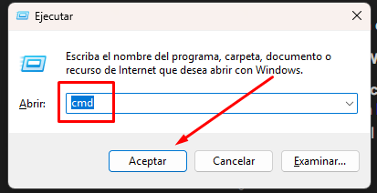
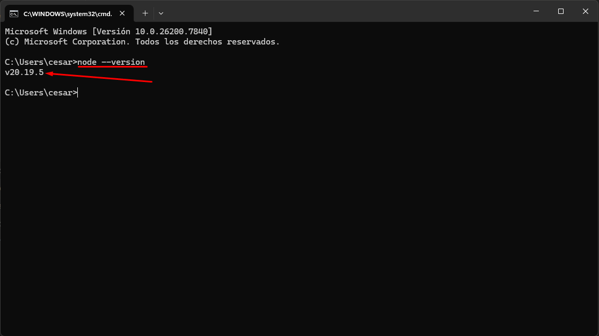
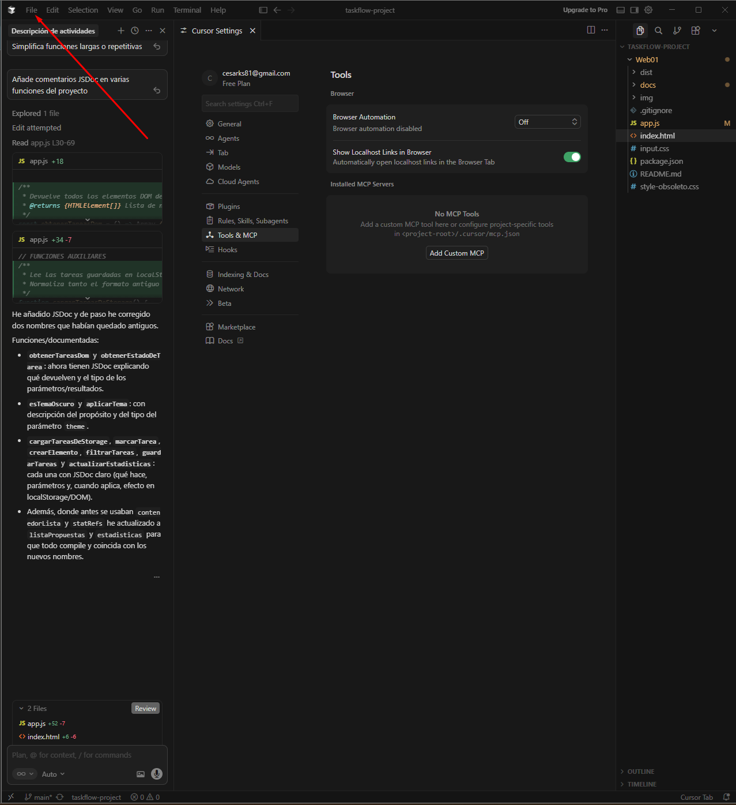
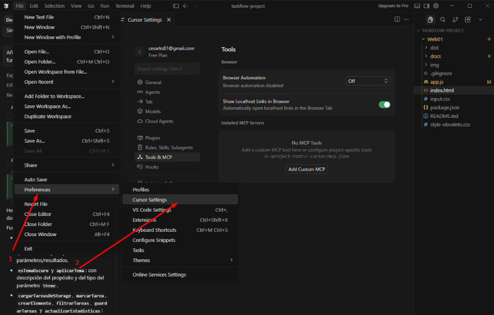
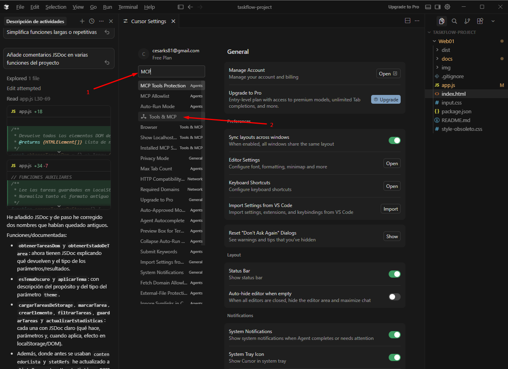
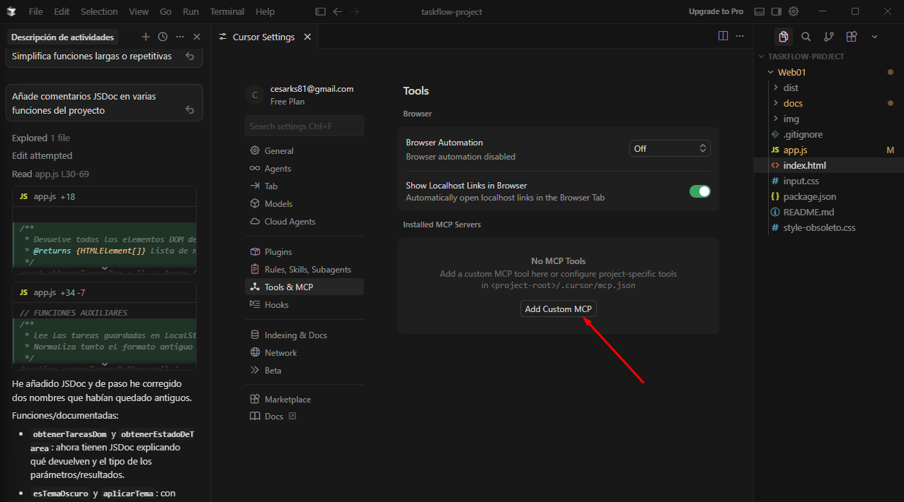

## Flujo de Trabajo con Cursor

### Introducción
Este documento describe la integración del editor Cursor en el proceso de desarrollo. Se detalla cómo las funciones nativas de IA del editor (autocompletado, chat de contexto y predicción de código) han optimizado la escritura del código y la navegación por la estructura del proyecto de la lista de tareas.

### Atajos de Teclado

Los atajos más utilizados son:


`Ctrl + K`  : Escribir código desde cero o editar una sección

`Ctrl + L`  : Abrir la barra lateral para hacer preguntas sobre el archivo o conjunto de ellos

`Ctrl + I`  : Abrir el Composer para editar varios archivos a la vez

`Tab`       : Aceptar los autocompletados o sugerencias


Otro comando menos utilizado pero igualmente útil:

| `Ctrl + B`: Ocultar o mostrar la barra lateral derecha

### Optimización de Código JavaScript

Nada más instalar Cursor, lo primero fue pedirle ayuda para verificar y optimizar un problema en el código JavaScript. Ante la duda de si el código estaría bien optimizado dado que contiene muchas funciones interdependientes, se le solicitó que optimizase el archivo completo desde el chat integrado. Su respuesta fue:

> "Tu código ya está bastante bien estructurado; no hay errores gordos. Te dejo una versión optimizada y un poco más limpia, manteniendo exactamente el mismo comportamiento."

Al revisar los cambios, lo más significativo fue la introducción de **helpers**: pequeñas funciones de ayuda que realizan una tarea concreta y se reutilizan en varios puntos del código, mejorando notablemente la reutilización y legibilidad.

---

### Mejoras Estéticas de la Web

Cursor también ayudó a mejorar la estética de la web, proporcionando varios *tips* para darle un aspecto más profesional y cuidado. Tras revisarlos, se aplicó únicamente el que visualmente encajaba mejor.

#### Corrección del Hover en el Footer

Se detectó un pequeño error de diseño: al activar el hover sobre los elementos del footer (Total, Completadas, Pendientes), el texto se volvía blanco, haciéndolo prácticamente invisible al coincidir con el color de fondo.

**Solución:** cambiar el color del hover en los tres elementos.

De:
```css
hover:text-white
```

A:
```css
hover:text-gray-400 dark:hover:text-white
```

Con este cambio, en modo claro el texto sigue siendo visible y el efecto hover se mantiene correctamente.

---

### Instalación de un Servidor MCP en Cursor

#### Requisitos previos

Es necesario tener **Node.js** instalado. Para verificarlo, abriremos una terminal (en Windows `Win + R`, escribimos `cmd` y pulsamos Enter).



Dentro de la terminal escribiremos:
```bash
node --version
```

Debería mostrarse la versión instalada.



Si aparece un error confirmando la ausencia de Node.js, deberemos instalarlo desde:
[https://nodejs.org/es](https://nodejs.org/es)

---

#### Pasos de instalación

Una vez tengamos Node.js, empezaremos con la instalación del servidor MCP. En nuestro caso instalaremos **filesystem**.

**1.** Abrimos Cursor y nos dirigimos a la zona superior izquierda seleccionando **File**.



**2.** Navegamos a **Preferences** → **Cursor Settings**.



**3.** Se abrirá el menú de configuración. En el cuadro de búsqueda escribimos `MCP` y seleccionamos **Tools & MCP**.



**4.** Aparecerá la sección **Installed MCP Servers**. Hacemos clic en **Add Custom MCP**.



**5.** Se abrirá el archivo `mcp.json`. Escribimos lo siguiente con la ruta absoluta de nuestro proyecto:
```json
{
  "mcpServers": {
    "filesystem": {
      "command": "npx",
      "args": [
        "-y",
        "@modelcontextprotocol/server-filesystem",
        "C:\\Users\\cesar\\Desktop\\taskflow-project"
      ]
    }
  }
}
```

> ⚠️ En Windows usar `\\` en lugar de `/` para evitar errores de ruta.

**6.** Cerramos y volvemos a abrir Cursor. El servidor MCP filesystem ya estará disponible y podrá acceder al directorio del proyecto para leer y modificar sus archivos.

---

### Por qué me parece útil el MCP

**taskflow-project** tiene varios archivos interconectados: `app.js` con casi 300 líneas, estilos divididos entre `input.css` y `output.css`, y el `index.html`. A medida que el proyecto crezca, tener que abrir y copiar cada archivo manualmente en el chat es lento y tedioso.

Con el MCP activo puedo pedirle cosas como *"revisa todo el proyecto y dime si hay código duplicado"* o *"añade comentarios JSDoc a todas las funciones de app.js"* y Cursor lo hará solo, sin necesidad de indicarle manualmente dónde mirar.

También resulta muy útil cuando hay un bug cuyo origen no está claro — puede rastrear cómo se llaman las funciones entre archivos y encontrarlo sin que tengamos que guiarle paso a paso.