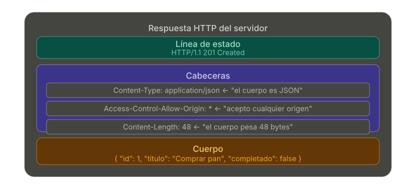
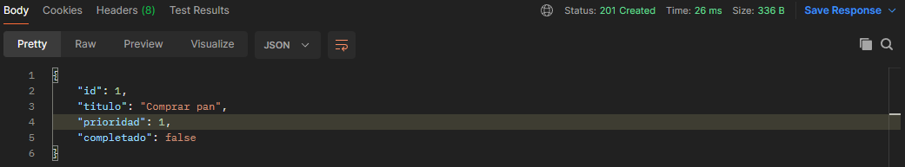
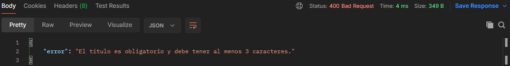
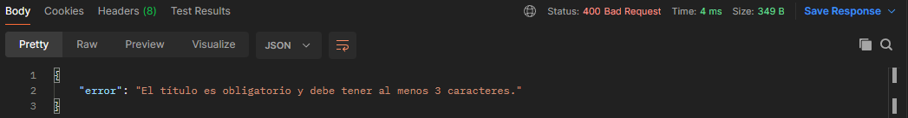
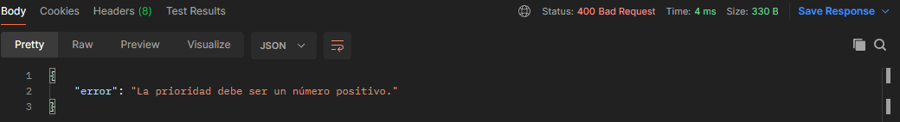
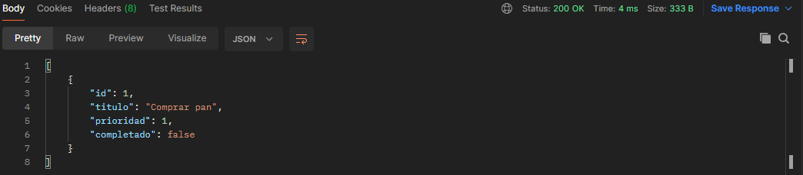
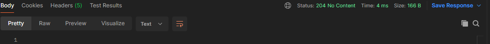
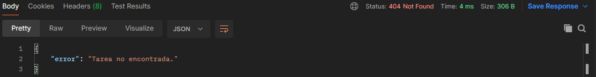
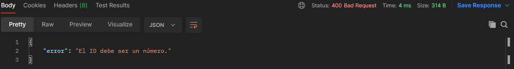

# Experimentos y Pruebas con el servidor

## Introducción
Este archivo registra los experimentos realizados durante el desarrollo, incluyendo aquellos que no funcionaron a la primera, explicando cómo se iteró con el servidor hasta encontrar la solución estratégica definitiva.

Para este ejemplo utilizaremos Node.JS con las siguientes herramientas:
- express: framework que convierte Node.js en un servidor web de manera simple
- cors: resuelve un problema de seguridad. Permitiendo que se comuniquen el frontend y el backend
    
    [http://localhost:5500](http://localhost:5500/)   ← frontend (Live Server de VS Code)

    [http://localhost:3000](http://localhost:3000/)   ← backend (Express)
    
    Cors añade a las cabeceras de respuesta del servidor una “puerta abierta” traducido como Access-Control-Allow-Origin: * 
    
    
    
- dotenv: únicamente lee el archivo .env y carga cada línea como variable en process.env
- nodemon: herramienta que vigila los archivos y recarga el servidor cuando hay un cambio en ellos.

## Pruebas

**Caso 1 — Crear tarea correctamente**
```
POST /api/v1/tasks
Body: { "titulo": "Comprar pan", "prioridad": 1 }
```


**Caso 2 — Crear tarea sin título**
```
POST /api/v1/tasks
Body: { "prioridad": 1 }
```


**Caso 3 — Crear tarea con título demasiado corto**
```
POST /api/v1/tasks
Body: { "titulo": "ab", "prioridad": 1 }
```


**Caso 4 — Crear tarea con prioridad como texto**
```
POST /api/v1/tasks
Body: { "titulo": "Comprar pan", "prioridad": "alta" }
```


**Caso 5 — Obtener todas las tareas**
```
GET /api/v1/tasks
```


**Caso 6 — Eliminar tarea existente**
```
DELETE /api/v1/tasks/1
```


**Caso 7 — Eliminar tarea que no existe**
```
DELETE /api/v1/tasks/999
```


**Caso 8 — Eliminar con ID no numérico**
```
DELETE /api/v1/tasks/abc
```
